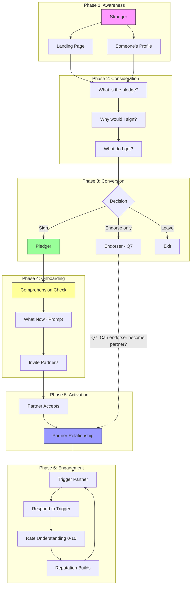

# P16: User Journey Map & Open Questions

## Purpose

This document maps the complete user journey from stranger to active partner, and captures all open design questions that must be answered before we can define features properly.

**Status:** Working document — use this to drive design decisions.

---

## The Three User Types

| Type | Description | Current State |
|------|-------------|---------------|
| **Stranger** | Never heard of the pledge | Lands on landing page or someone's profile |
| **Pledger** | Signed the Understanding Pledge | Has profile, may or may not comprehend mechanics |
| **Partner** | Has at least one Clarity Partner | Can trigger/be triggered online |

---

## Current User Journey (What Exists Today)

```
Stranger
    │
    ├─→ Lands on landing page
    │       └─→ Signs pledge → Profile created → ??? (dead end)
    │
    └─→ Lands on someone's profile
            └─→ Endorses pledge → "Take your own pledge" CTA → ???
```

**Problems:**
- After signing: "What now?"
- After endorsing: confusing UI, dead end
- No path to becoming partners
- No comprehension verification

---

## Proposed User Journey (To Design)

### Visual Flowchart



### Text Version

```
PHASE 1: AWARENESS
Stranger lands on:
    ├─→ Landing page (direct traffic)
    └─→ Someone's profile (shared link)

PHASE 2: CONSIDERATION
Stranger learns:
    ├─→ What is the pledge?
    ├─→ Why would I sign?
    └─→ What do I get?

PHASE 3: CONVERSION
Stranger decides:
    ├─→ Sign the pledge → becomes Pledger
    └─→ Don't sign → leave (or endorse without signing?)

PHASE 4: ONBOARDING (Pledger)
New pledger:
    ├─→ Comprehension check (understand mechanics)
    ├─→ "What now?" prompt
    └─→ ??? (invite partner? join group? practice?)

PHASE 5: ACTIVATION (Partner)
Pledger becomes Partner:
    ├─→ Invites someone as partner
    ├─→ OR accepts partner invite
    └─→ ??? (what happens next?)

PHASE 6: ENGAGEMENT (Active Use)
Partner uses the system:
    ├─→ Triggers partner online (async)
    ├─→ Responds to triggers
    ├─→ Rates understanding
    └─→ ??? (where does this happen? feed? notifications?)
```

---

## Open Questions

### Q1: What is a Clarity Partner?

| Option | Description | Implications |
|--------|-------------|--------------|
| **A) Two pledgers** | Both must sign the pledge | Limits growth, but ensures commitment |
| **B) Any two users** | Partner ≠ pledger | Faster growth, but what's the commitment? |
| **C) One-way relationship** | I invite you, I can trigger you, you can't trigger me | Power asymmetry, confusing? |
| **D) Two-way relationship** | We can trigger each other | Mutual, but requires both to understand |

**Current assumption in docs:** Two pledgers (Option A)
**Your recent thinking:** Any two users (Option B)

**DECISION NEEDED:** _______________

---

### Q2: What does "becoming partners" mean?

| Option | Description |
|--------|-------------|
| **A) Explicit invite** | I send invite, you accept |
| **B) Mutual endorsement** | We both endorse each other's pledges |
| **C) Automatic** | If we both have pledges and interact, we're partners |

**DECISION NEEDED:** _______________

---

### Q3: Who triggers the new user's comprehension check?

| Option | Description |
|--------|-------------|
| **A) System/onboarding** | Automatic after signup |
| **B) The inviter** | Person who invited them |
| **C) AI avatar** | Bot that guides them |
| **D) Practice group** | Join a session with others |

**DECISION NEEDED:** _______________

---

### Q4: How do new partners learn to practice?

| Option | Description |
|--------|-------------|
| **A) Read documentation** | Self-serve, low friction, low comprehension |
| **B) Interactive onboarding** | Quiz-style comprehension check |
| **C) Live practice session** | Join a group, practice with real people |
| **D) Practice with inviter** | First trigger is guided by the person who invited |

**DECISION NEEDED:** _______________

---

### Q5: Where do ideas/triggers live?

| Option | Description |
|--------|-------------|
| **A) Profile page** | Each user has ideas on their profile |
| **B) Feed** | Central feed of all ideas from partners |
| **C) Direct messages** | Private between two partners |
| **D) External** | Platform just tracks triggers, content lives elsewhere |

**DECISION NEEDED:** _______________

---

### Q6: Is partnership one-way or two-way?

| Option | Implications |
|--------|--------------|
| **One-way** | I can trigger you, you can't trigger me (unless you also invite me) |
| **Two-way** | If we're partners, either can trigger the other |

**Your recent thinking:** Leaning toward two-way mutual

**DECISION NEEDED:** _______________

---

### Q7: What happens when someone endorses a pledge but doesn't sign?

Current: Confusing dead end

| Option | Description |
|--------|-------------|
| **A) Just acknowledge** | "Thanks for endorsing" — no push |
| **B) Soft CTA** | "Want to sign your own?" — optional |
| **C) Block until sign** | Can't endorse without signing |
| **D) Non-pledger partner** | Can be partner without pledging (but can't be triggered?) |

**DECISION NEEDED:** _______________

---

### Q8: What motivates someone to trigger their partner?

This is the KEY question for engagement.

| Motivation | How Platform Supports |
|------------|----------------------|
| **Emotional moment** | "I need to be understood right now" → easy trigger |
| **Conflict resolution** | "We disagree, let's verify understanding" |
| **Habit/practice** | Regular prompts to practice |
| **Reputation building** | Triggers build your "listener score" |

**DECISION NEEDED:** What's the primary use case we design for?

---

### Q9: What does the inviter get when inviting a partner?

| Benefit | Description |
|---------|-------------|
| **Someone to trigger** | They can ask partner to understand them |
| **Accountability** | Partner holds them to their pledge |
| **Reputation** | More partners = more credibility? |
| **Nothing explicit** | Just the relationship itself |

**DECISION NEEDED:** _______________

---

### Q10: Do we need the Ideas Platform for MVP?

The pledge is ONE idea. Partners is a relationship system.

| Option | What It Means |
|--------|---------------|
| **Yes, needed** | Ideas are central to how triggers work |
| **No, defer** | Triggers can work without formal "ideas" — just text/content |

**DECISION NEEDED:** _______________

---

## Concepts That Need Clarification

### Pledge vs Partner vs Ideas

```
Current confusion:

"The pledge" = The Understanding Pledge (one specific promise)
"Ideas" = Statements people agree/disagree with (pledge is one idea)
"Partners" = People who practice together

Are these connected? Separate? Required for each other?
```

### Endorsement vs Witness vs Partner

```
Current system has:
- Witness = someone who endorsed a pledge
- witness_profile_id = link to their profile (unused)

New concept:
- Partner = someone you practice with

How do these relate?
- Does endorsing make you a witness?
- Does being a witness make you a partner?
- Can you be a partner without being a witness?
```

---

## What We Know For Sure

1. **Comprehension check (p12) is clear** — 7 statements, agree/disagree/don't know
2. **Admin dashboard (p15) is clear** — Slava sees responses, identifies misconceptions
3. **North Star metric is clear** — Time × Frequency × Number of People paraphrasing

---

## Recommended Next Steps

1. **Answer Q1-Q3** — These unlock the journey design
2. **Sketch the minimal journey** — Stranger → Pledger → Partner with fewest steps
3. **Identify MVP scope** — What's the smallest thing that creates value?
4. **Then** extract features from the journey

---

## Related Documents

- [p12_onboarding-comprehension-check.md](./p12_onboarding-comprehension-check.md) — Comprehension check (clear)
- [p13_future-ideas-meme-platform.md](./p13_future-ideas-meme-platform.md) — Ideas platform (future)
- [p14_clarity-partners-network-effects.md](./p14_clarity-partners-network-effects.md) — Partners (needs redesign based on this doc)
- [p15_admin-dashboard.md](./p15_admin-dashboard.md) — Admin dashboard (clear)
